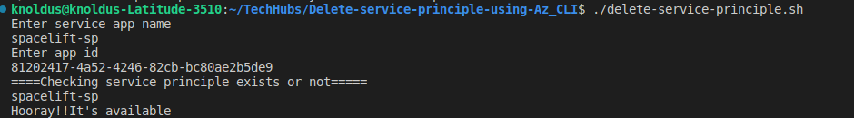

## Short Description 
This shell script helps to delete Service principle in Azure.

---

### Note

We are storing all the names of service principle in `sp-list.txt` which is generating while running the script only.

---

### Steps for Execution 
1. Go to the terminal
2. Login in the azure account through CLI `az login`
3. Change the permission of the script using `chmod a+x delete-service-principle.sh`
4. Run the script using the command`./delete-service-principle.sh`

---
### Output
After run the script it take value at runtime for creating Service Principle.

---